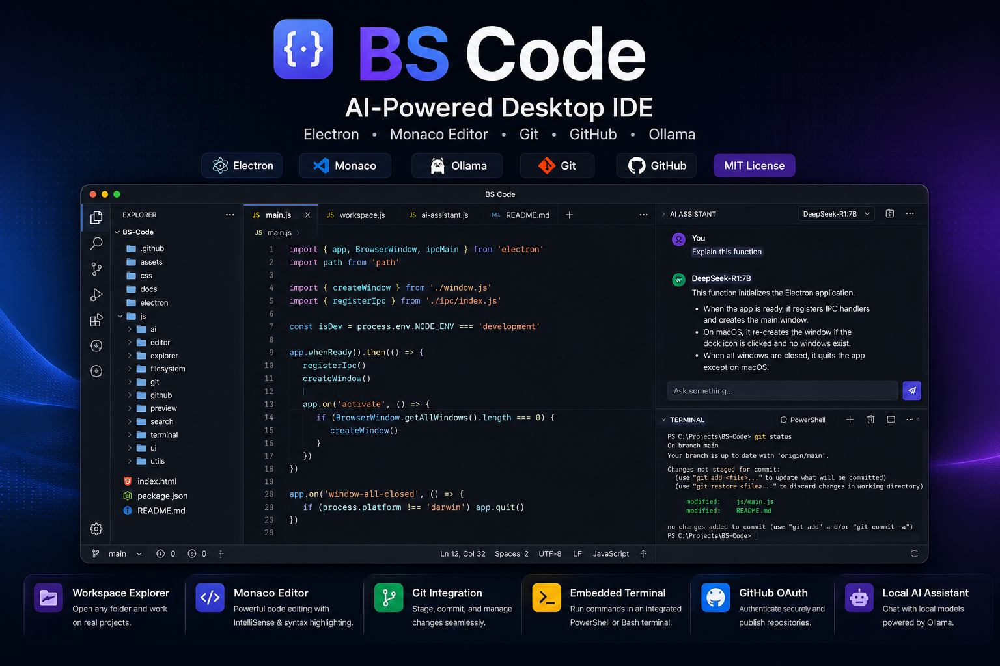
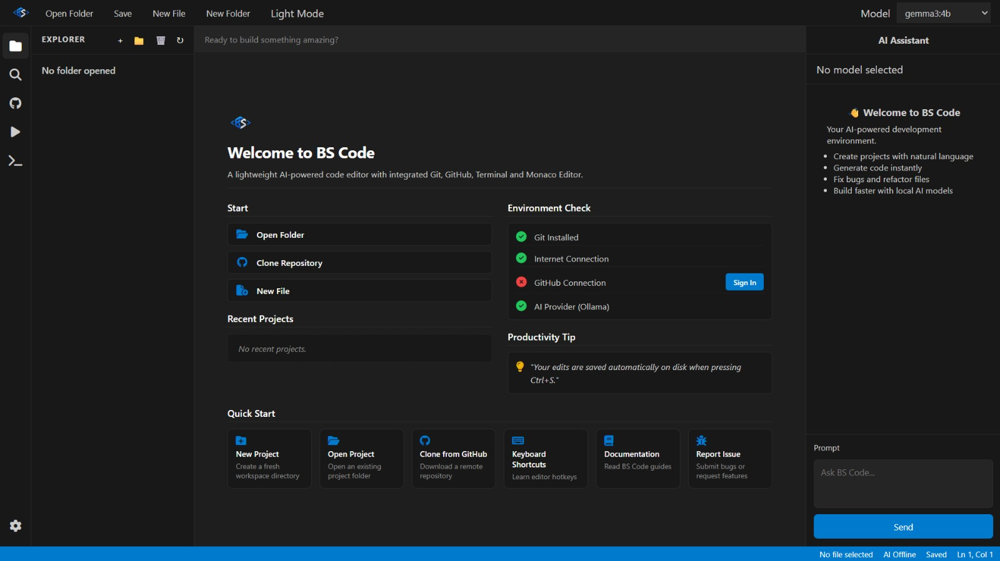
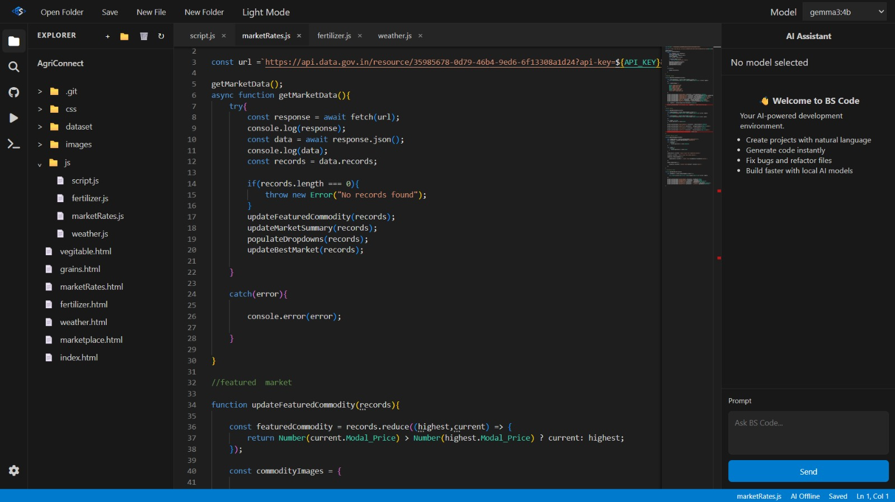
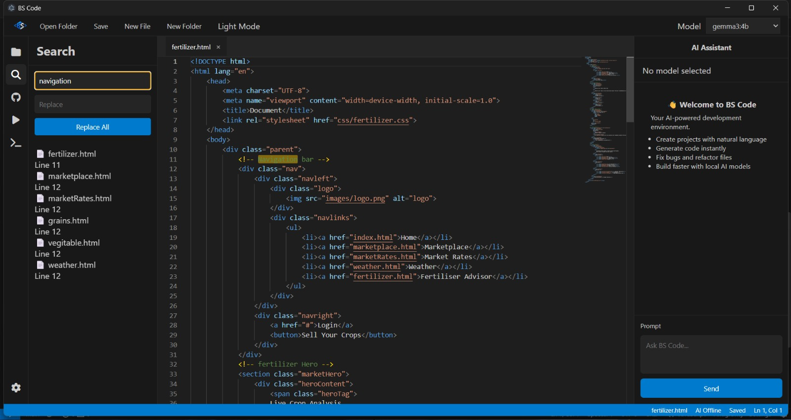
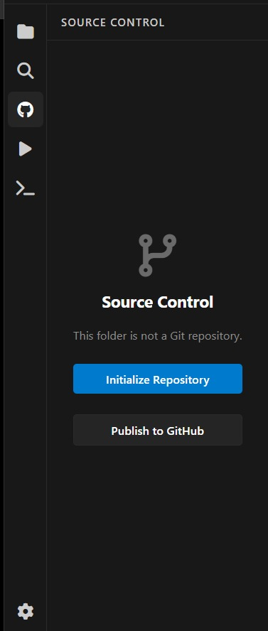
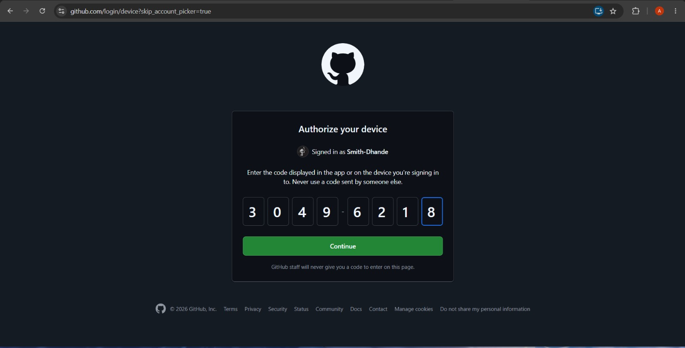
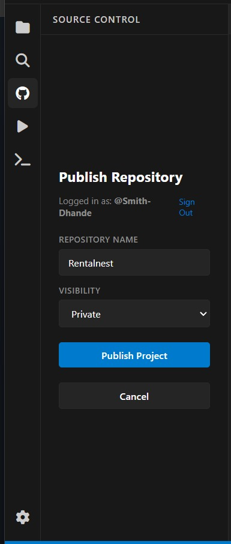
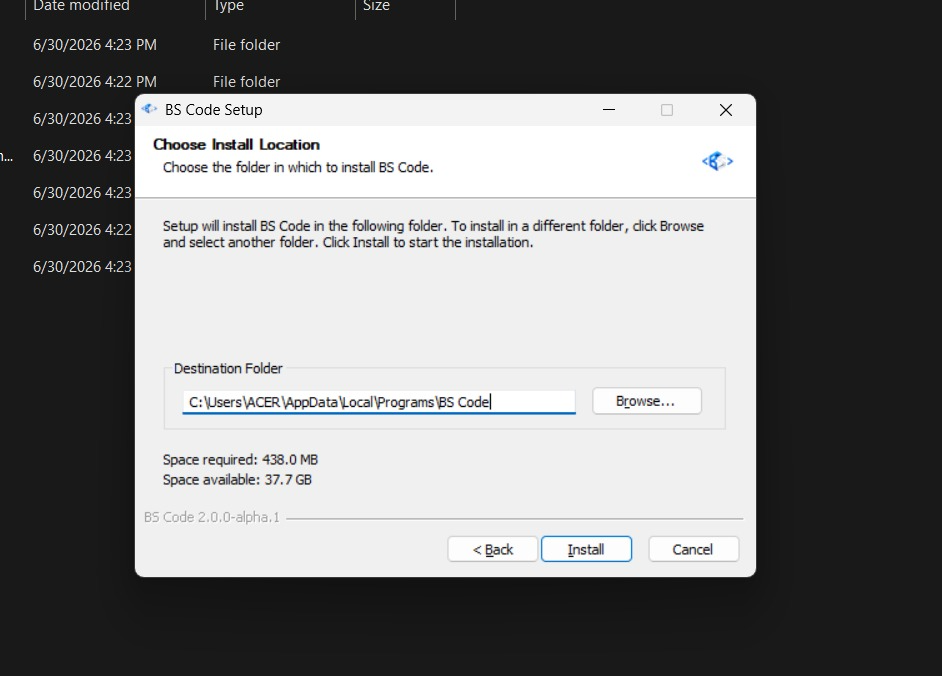
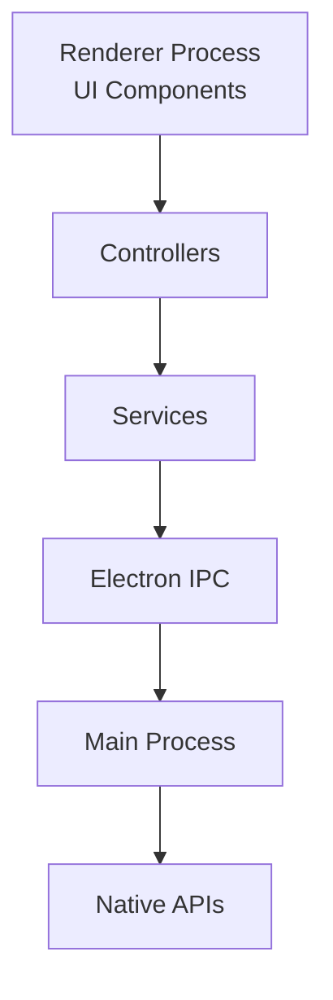

<div align="center">

# BS Code

### AI-Powered Desktop IDE built with Electron, Monaco Editor, and Local AI Models.

Build, edit, debug, commit, and experiment — while learning how modern developer tools are engineered.

> **Inspired by modern developer tools. Built to understand how they're engineered.**

<br>


<br>

[Features](#-features) •
[Screenshots](#-screenshots) •
[Architecture](#-architecture) •
[Installation](#-installation) •
[Roadmap](#-roadmap)

</div>

---

<p align="center">
  
</p>

<p align="center">
  <em>BS Code running with Workspace Explorer, Monaco Editor, AI Assistant, Source Control and Embedded Terminal.</em>
</p>

---

# Why BS Code?

## Why BS Code?

Most developers build web applications. I wanted to understand how professional desktop developer tools are engineered.

BS Code is a personal project built to explore the architecture behind modern IDEs—not to replace Visual Studio Code or Cursor, but to learn by implementing the systems that power them.

Built with Electron, Monaco Editor, Git, GitHub, an embedded terminal, and local AI, BS Code has evolved from a simple browser-based editor into a full desktop IDE and continues to grow toward its first public alpha release.


---

# Why the name "BS Code"?

The name usually gets a laugh.

No, it doesn't stand for **"Bad Software."**

It originally started as a joke, but the project quickly became much more than that.

Today, **BS Code** represents a hands-on journey into desktop software engineering—building complex systems from scratch to understand how professional developer tools actually work under the hood.

By the Way BS Code Stands For **Beyond Syntax Code** — where writing code is just the first step.
Debugging your own IDE was never part of the original plan. 

---

# ✨ Highlights

- Desktop application built with **Electron**
- Monaco Editor integration
- Workspace Explorer with real folder access
- Integrated Git Source Control
- GitHub OAuth Device Flow authentication
- Local AI Assistant powered by Ollama
- Embedded Terminal
- Project-wide Search & Replace
- Live HTML/CSS/JavaScript Preview
- Windows Installer
- Modern IDE-inspired interface

---

# 🚀 Features

| Category | Features |
|----------|----------|
| **Editor** | Monaco Editor, Multi-tab editing, Syntax Highlighting, Autosave, Multiple Language Support |
| **Workspace** | Open Folder, Nested Explorer, Recent Projects, Workspace Restoration |
| **Search** | Project Search, Find & Replace |
| **Source Control** | Repository Detection, Initialize Repository, Git Status, Commit Workflow |
| **GitHub** | OAuth Device Flow, Clone Repository, Publish Repository |
| **AI** | Ollama Integration, DeepSeek, Gemma, Qwen, Llama |
| **Terminal** | Embedded PowerShell / Bash Terminal |
| **Preview** | Live HTML/CSS/JavaScript Preview |
| **Desktop** | Electron Desktop App, Windows Installer, Theme Support |

---

# 📸 Screenshots

## Welcome Experience

<p align="center">

</p>

A clean onboarding experience with quick actions, recent projects, environment checks, and shortcuts to help users start working immediately.

---

## Workspace & Editor

<p align="center">

</p>

Monaco Editor powers the editing experience with syntax highlighting, multi-tab support, workspace management, and an IDE-inspired layout.

---

## Project Search

<p align="center">

</p>

Quickly search across the entire workspace and locate files or content without leaving the editor.

---

## Source Control

<p align="center">

</p>

Track repository changes, stage files, write commit messages, and manage Git workflows directly inside BS Code.

---

## GitHub Authentication

<p align="center">

</p>

Authenticate securely using GitHub OAuth Device Flow without embedding secrets or requiring a backend service.

---

## Publish Repository

<p align="center">

</p>

Create and publish repositories to GitHub without leaving the editor.

---

## Embedded Terminal

<p align="center">

</p>

Run PowerShell or Bash directly inside the current workspace. The terminal is backed by real native processes rather than a simulated console.

---

## Windows Installer

<p align="center">

</p>

BS Code packages into a native Windows installer using Electron Builder, complete with desktop and Start Menu integration.

---
# 🏗️ Architecture

BS Code follows a layered architecture that keeps the user interface separate from business logic and native operating system functionality.

This separation makes the project easier to maintain, extend, and debug as new features are added.



```text
Renderer (UI)
      │
      ▼
Controllers
      │
      ▼
Services
      │
      ▼
Electron IPC
      │
      ▼
Main Process
      │
      ▼
Native APIs
```

### Layer Responsibilities
<div align="center">
| Layer | Responsibility |
|---------|----------------|
| **Renderer** | User interface, components, editor layout, and interactions. |
| **Controllers** | Coordinate user actions and communicate with services. |
| **Services** | Business logic for Git, AI, Terminal, Explorer, GitHub, and Workspace. |
| **Electron IPC** | Secure communication between the renderer and main process. |
| **Main Process** | Access to native operating system functionality. |
| **Native APIs** | Filesystem, Git, Terminal, Child Processes, Secure Storage, and OS integrations. |
</div >
---

# 📂 Hybrid Filesystem Architecture

BS Code intentionally combines **Browser APIs** with **Electron APIs** instead of routing every operation through Electron.

This approach keeps file editing lightweight while allowing privileged operations to remain secure.
<div align="center">

| Component | Technology |
|-----------|------------|
| Workspace Explorer | Browser File System Access API |
| Monaco Editor | Browser APIs |
| Git Operations | Electron |
| Embedded Terminal | Electron |
| GitHub Authentication | Electron |
| Native File Operations | Electron |
</div>

This hybrid architecture allows the editor to remain responsive while still supporting native desktop capabilities such as Git, Terminal, and GitHub integration.

---

# ⚙️ Technology Stack

| Category | Technology |
|----------|------------|
| **Desktop Framework** | Electron |
| **Frontend** | HTML5, CSS3, Vanilla JavaScript (ES Modules) |
| **Editor** | Monaco Editor |
| **AI** | Ollama |
| **Supported Models** | DeepSeek, Gemma, Qwen, Llama |
| **Version Control** | Git |
| **Authentication** | GitHub OAuth Device Flow |
| **Packaging** | Electron Builder |
| **Native APIs** | Browser File System Access API, Electron IPC, Node.js, child_process |

---

# 📁 Project Structure

```text
BS-Code
│
├── assets/                # Icons, images and README screenshots
│
├── css/                   # Application styles
│
├── js/
│   ├── ai/                # AI integration
│   ├── editor/            # Monaco editor
│   ├── explorer/          # Workspace explorer
│   ├── filesystem/        # File operations
│   ├── git/               # Git integration
│   ├── github/            # GitHub integration
│   ├── preview/           # Live preview
│   ├── search/            # Search & Replace
│   ├── terminal/          # Embedded terminal
│   ├── ui/                # UI components
│   └── utils/             # Shared utilities
│
├── electron/
│   ├── ipc/               # IPC handlers
│   ├── services/          # Native business logic
│   ├── main.js
│   └── preload.js
│
├── package.json
│
└── README.md
```

The project is organized by **feature**, allowing each subsystem to evolve independently while keeping responsibilities clearly separated.

---

# 🚀 Getting Started

## Prerequisites

Before running BS Code, ensure the following software is installed:

- Node.js (LTS recommended)
- Git
- Ollama *(optional — required only for AI features)*

---

## Clone the Repository

```bash
git clone https://github.com/Smith-Dhande/B-S-Code.git

cd B-S-Code
```

---

## Install Dependencies

```bash
npm install
```

---

## Run in Development

```bash
npm run dev
```

This launches BS Code in development mode using Electron.

---

## Build the Desktop Application

```bash
npm run dist
```

Electron Builder will generate the application inside the `dist` directory.

---

## Output

```text
dist/

├── BS-Code-Setup-x.x.x.exe
├── win-unpacked/
└── latest.yml
```

The generated installer includes:

- Desktop Shortcut
- Start Menu Shortcut
- Windows Uninstaller
- Native Windows Installation Wizard

---
# 🚧 Current Status

BS Code is currently in **Alpha** and under active development.

The core editor experience is already functional, including workspace management, source control, GitHub integration, AI assistance, embedded terminal, and desktop packaging.

The current focus is on improving stability, refining the user experience, and preparing the project for its first public alpha release.

---

# 🛣️ Roadmap

## Alpha

The current milestone focuses on stability and polishing the existing experience.

- [x] Electron Desktop Application
- [x] Monaco Editor Integration
- [x] Workspace Explorer
- [x] Multi-tab Editing
- [x] Search & Replace
- [x] Embedded Terminal
- [x] Local AI Assistant
- [x] Live Preview
- [x] Git Integration
- [x] GitHub OAuth Authentication
- [x] Publish Repository
- [x] Windows Installer

### Currently Working On

- [ ] Rename Files & Folders
- [ ] Git History
- [ ] Monaco Diff Editor
- [ ] Branch Management
- [ ] Workspace Settings
- [ ] Performance Improvements
- [ ] UI & UX Polish

---

## Beta

The Beta milestone focuses on expanding developer productivity.

- [ ] Multiple Editor Groups
- [ ] Plugin System
- [ ] Extension API
- [ ] AI Refactoring Tools
- [ ] Workspace Profiles
- [ ] Better Git Visualization
- [ ] Improved Search Performance

---

## Version 1.0

The long-term vision for BS Code.

- [ ] Language Server Protocol (LSP)
- [ ] Integrated Debugger
- [ ] Cross-platform Releases
- [ ] Auto Updates
- [ ] Plugin Marketplace
- [ ] Performance Profiling
- [ ] Complete Documentation

---

# 🤝 Contributing

Contributions, suggestions, feature requests, and bug reports are always welcome.

If you'd like to contribute:

1. Fork the repository.
2. Create a feature branch.

```bash
git checkout -b feature/amazing-feature
```

3. Make your changes.
4. Commit using Conventional Commits.

```text
feat(editor): add rename support
fix(git): resolve publish workflow issue
refactor(explorer): simplify tree rendering
```

5. Push your branch.

```bash
git push origin feature/amazing-feature
```

6. Open a Pull Request.

For larger changes, please open an issue first so we can discuss the proposed implementation.

---

# 💡 Design Principles

BS Code is built around a few simple principles:

- Build to understand, not to imitate.
- Keep architecture modular.
- Separate UI from business logic.
- Prefer maintainable solutions over shortcuts.
- Learn by implementing real systems.
- Keep the developer experience clean and intuitive.

---

# ⭐ Support the Project

If you find BS Code interesting, consider giving the repository a ⭐.

It helps more developers discover the project and motivates continued development.

If you have ideas, feedback, or suggestions, feel free to open an issue or start a discussion.

---

# 📄 License

Distributed under the **MIT License**.

See the [LICENSE](LICENSE) file for more information.

---

<div align="center">

## BS Code

**AI-Powered Desktop IDE**

Built with **Electron**, **Monaco Editor**, **Vanilla JavaScript**, and **Ollama**.

Designed to explore how modern developer tools are engineered.

<br>

⭐ **If you enjoyed this project, consider giving it a star.**

</div>
