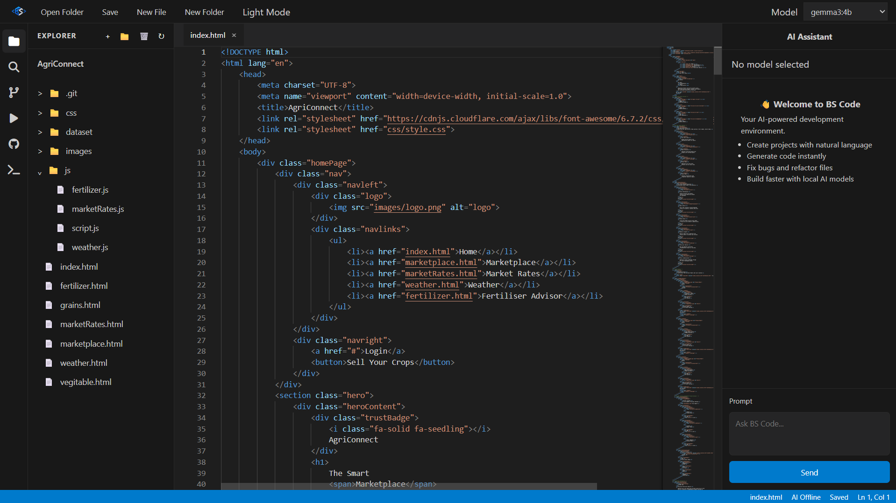
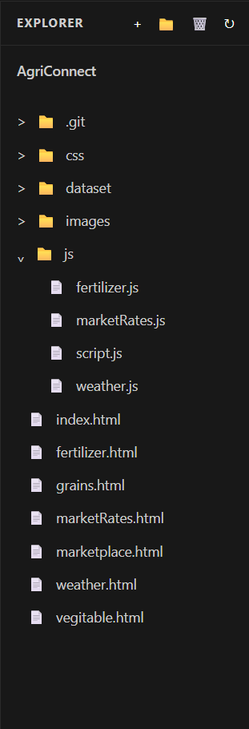
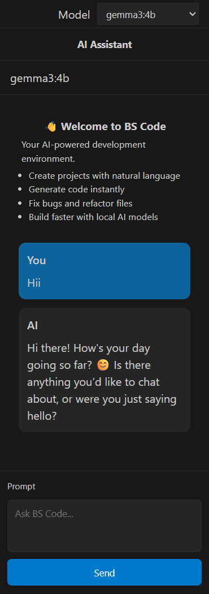
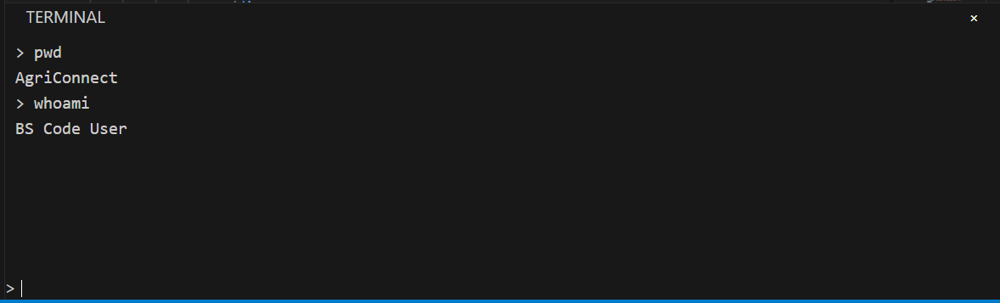

# BS Code

A browser-based code editor that looks suspiciously like VS Code but was built with pure HTML, CSS, and JavaScript because apparently suffering builds character.

> A code editor built because creating a browser IDE sounded easier than learning self-control.

## Features

* Open real folders from your system
* Create, edit, and save files
* File explorer with tabs
* Monaco Editor integration
* Syntax highlighting for multiple languages
* Local AI coding assistant powered by Ollama
* Switch between DeepSeek, Gemma, Qwen, and other models
* Save changes without sacrificing a goat to the JavaScript gods
* Dark theme because every developer is legally required to have one

## Why "BS Code"?

Because:

* AI writes half the code.
* The developer takes credit for the other half.
* Bugs somehow fix themselves and then reappear later.
* Every debugging session eventually becomes a philosophical discussion.
* Most programming turns into BS anyway.

## Built With

* HTML
* CSS
* JavaScript
* Monaco Editor
* Ollama
* Determination
* Coffee
* Questionable life choices

## Project Status

BS Code is currently under active development.

Some features work exactly as intended.

Some features work accidentally.

A few features are still negotiating their existence.

Jokes aside, the core editor, file management system, terminal, AI integration, and live preview are fully functional.

New features and improvements are being added regularly as the project evolves.

## Screenshots

### Full IDE

The complete BS Code workspace with file explorer, editor, AI assistant, and terminal.

### File Explorer

Browse projects, navigate nested folders, and manage files.

### AI Assistant

Local AI coding assistant powered by Ollama with support for multiple models.

### Embedded Terminal

Built-in terminal for running commands without leaving the editor.

## Roadmap

### Current Features

* [x] Open folders
* [x] Restore previously opened projects
* [x] Open files
* [x] Create files
* [x] Create folders
* [x] Delete files and folders
* [x] Monaco Editor integration
* [x] Tab management
* [x] Search and replace
* [x] Syntax highlighting
* [x] Multi-language syntax support (HTML, CSS, JS, JSON, Markdown, Python, Java, C, C++, C#, PHP, SQL, XML)
* [x] Project explorer with nested folders
* [x] Autosave
* [x] Local AI assistant via Ollama
* [x] Run HTML/CSS/JS projects
* [x] Live preview window
* [x] CSS injection for previews
* [x] JavaScript injection for previews
* [x] Image asset loading in previews
* [x] Embedded terminal
* [x] Terminal command system
* [x] Theme switching

### In Progress

* [ ] HTML diagnostics
* [ ] CSS diagnostics
* [ ] Better terminal commands
* [ ] Improved project persistence
* [ ] Explorer state restoration
* [ ] Preview auto-refresh

### Coming Soon

* [ ] Rename files
* [ ] Source control panel
* [ ] Git-style commit history
* [ ] Open file from terminal
* [ ] Run command from terminal
* [ ] Split editor view
* [ ] Multiple editor groups
* [ ] Better AI code actions
* [ ] Global project search

### Future Plans

* [ ] More AI models
* [ ] Project-wide code generation
* [ ] AI-powered refactoring
* [ ] Plugin system
* [ ] Electron desktop version
* [ ] Real Git integration
* [ ] Python execution
* [ ] World domination (optional)

## Disclaimer

This project is not affiliated with VS Code or Microsoft.

Any resemblance to existing code editors is completely intentional.

If it crashes, it's a feature.

If it works, it's probably a bug.

## Contributing

Found a bug?

Congratulations.

Feel free to open an issue, submit a pull request, or stare at the code until the problem fixes itself.

---

**BS Code — Turning bugs into features since 2026.**
